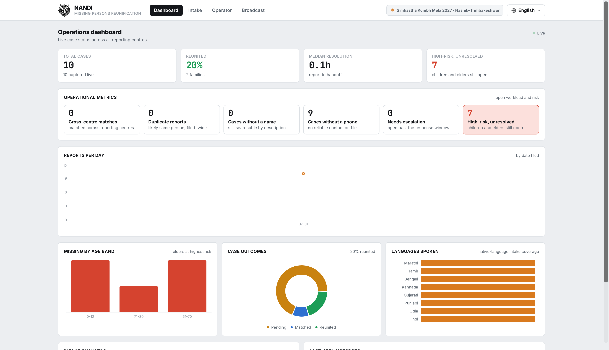
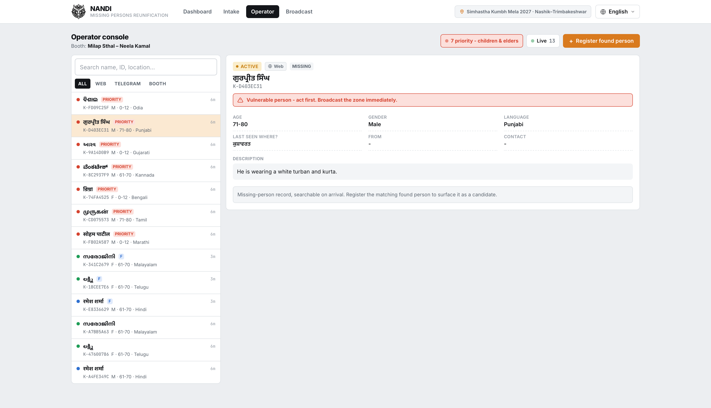
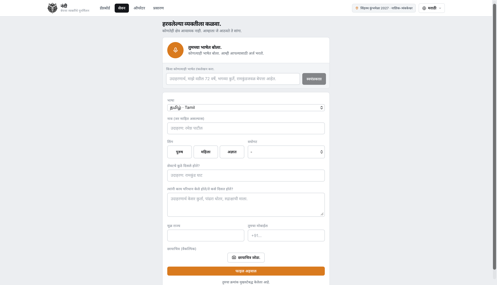
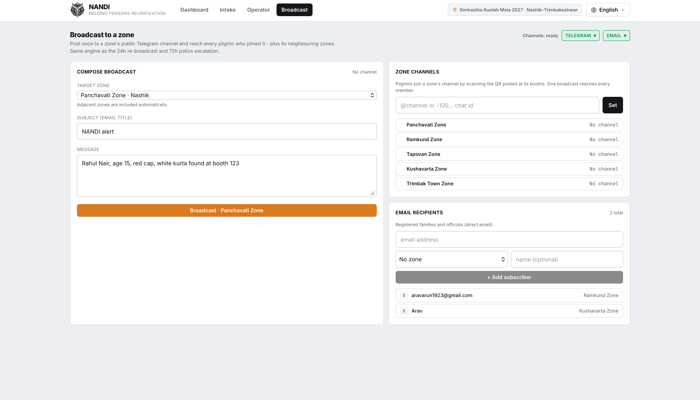
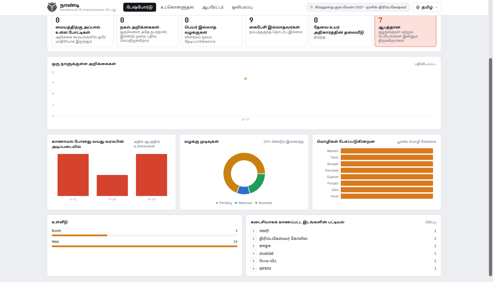
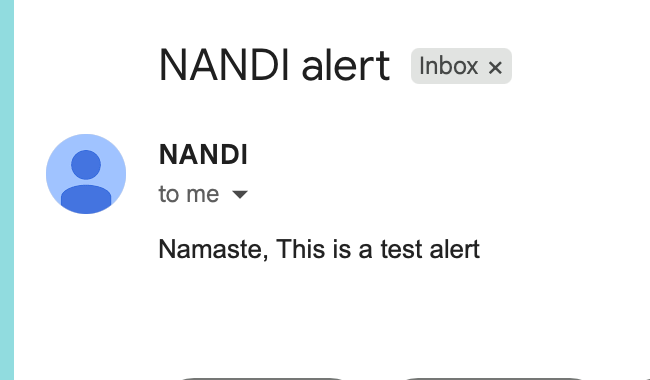
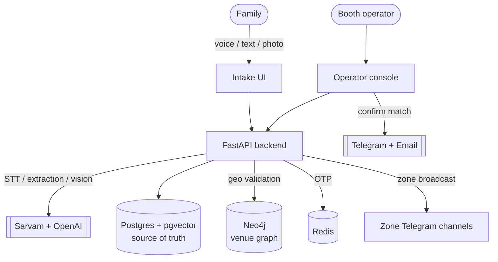

# 🐂 NANDI - Missing-Persons Reunification

**Simhastha Kumbh Mela 2027 · Nashik–Trimbakeshwar**

NANDI reunites missing people with their families at one of the world's largest
human gatherings (8–10 crore pilgrims). A family reports a missing person in any
language - by voice, Telegram, or at a booth. When someone is found and
registered, NANDI ranks likely matches for a booth operator using **multilingual
semantic search** (pgvector) and **graph validation** of the venue's geography
(Neo4j). The operator confirms; the family is notified with a booth location and
a one-time verification code they present to collect their relative.

> Built as an **operational control tool**, not a demo: the booth console, the
> family intake, and the command dashboard are designed for real use on cheap
> Android phones in bright daylight.

<table>
<tr>
<td width="50%" align="center"><b>Command dashboard</b><br/></td>
<td width="50%" align="center"><b>Operator console</b><br/></td>
</tr>
<tr>
<td align="center"><b>Family intake &middot; Marathi</b><br/></td>
<td align="center"><b>Zone broadcast</b><br/></td>
</tr>
<tr>
<td align="center"><b>Whole-UI translation &middot; Tamil</b><br/></td>
<td align="center"><b>Broadcast delivered</b><br/></td>
</tr>
</table>

---

## What it does

| Surface | For | What happens |
|---|---|---|
| **Intake** | Families | Report a missing person by **voice in any of 11 Indian languages** (Sarvam STT) or free text. An LLM extracts name/age/gender/clothing/last-seen into the form. An optional photo is auto-described and folded into the search text. |
| **Operator** | Booth staff | A live queue of cases. Register a found person → **AI-ranked candidates** with confidence + plain-language reasons. Confirm → verification code → mark reunited when the family arrives. |
| **Dashboard** | Command centre | Live operational metrics - open workload, escalations, high-risk cases, per-day load, language/channel/age/hotspot breakdowns. |
| **Broadcast** | Escalation | Reach a whole zone at Kumbh scale by posting once to its **Telegram channel** (see below). |

### Highlights

- **Whole UI translates** into every Sarvam-supported language (English, Hindi,
  Marathi, Bengali, Telugu, Tamil, Kannada, Gujarati, Malayalam, Punjabi, Odia) -
  real translations generated via Sarvam, one click in the header.
- **Kumbh-scale broadcast.** Individual opt-in lists can't reach crores. Each zone
  has a public **Telegram channel** pilgrims join by scanning a QR at the booths;
  a broadcast posts once per zone channel and reaches every member instantly.
  Email is kept for registered families/officials.
- **Vulnerable-person priority.** Open cases for children (≤12) and elders (≥70)
  are auto-flagged, pinned to the top of the operator queue, and can be broadcast
  immediately instead of waiting for the normal escalation window - learnt from
  past-Kumbh lapses in responding to the most at-risk.
- **Graceful degradation.** Every AI/notification dependency falls back safely if
  its key is missing, so a report is never dropped.

---

## Why it matters at the Nashik Kumbh 2027

The **Nashik-Trimbakeshwar Simhastha** is expected to draw **over 10 crore (100 million)
pilgrims** across July-September 2027, more than 3x the ~3 crore who came to the 2015
Simhastha. Peak bathing days (2 Aug, 31 Aug, 11-12 Sep 2027) each pack millions into a
handful of riverfront ghats.[^scale] At that density families get separated constantly,
and the people who go missing are disproportionately the most vulnerable.

**What the last Kumbh showed (Prayagraj 2025):**

| Verified figure | |
|---|---|
| People reported missing and reunited, most of them **women** | **~54,000**[^lf] |
| Reunited via the government digital Khoya-Paya Kendras / one NGO "Bhoole Bhatke" camp | 35,000+ / 19,274[^lf] |
| Lost **children** recovered | all 18[^lf] |
| Mauni Amavasya stampede (29 Jan 2025): killed / injured, incl. a 3-year-old, in a crowd surge | **≥30** (some counts ~79) / ~90[^crush] |

Today reunification is still run with **loudspeaker announcements, paper registers, and
separate manual camps**: slow, single-language, and center-by-center. Frantic searching
also drives the very crowd movement that turns a dense ghat into a crush.

**How NANDI helps:**

- **Reunify faster, in the pilgrim's own language.** A family reports by voice in any of
  11 Indian languages and the case is searchable across every center in seconds, so a
  report filed at Ramkund matches a person found at Trimbak. The 2025 caseload was
  overwhelmingly non-English speakers and mostly women, exactly NANDI's intake profile.
- **Protect the most at-risk first.** Missing children (≤12) and elders (≥70) auto-flag
  priority and can be broadcast to a zone immediately, a direct answer to the lapse of
  slow response for vulnerable persons.
- **Cut crush-driving search movement.** One post to a zone's Telegram channel reaches
  every pilgrim who joined it, directing families to a booth instead of pushing through
  the crowd to look.
- **One shared record.** Booths, families, and officials work off the same live case
  list and audit trail, instead of disconnected camps and registers.

### Scope of expansion

- **Every Mela and mass gathering.** The same system runs unchanged at the Prayagraj,
  Ujjain, and Haridwar Kumbhs, and at Pandharpur Wari, Sabarimala, Ganesh visarjan, and
  large civic/sporting events, anywhere crowds separate families.
- **Face-assisted matching.** Feed the existing photo pipeline into the AI
  facial-recognition already deployed at the government Khoya-Paya Kendras, for
  photo-first identification of people who cannot speak (small children, the disoriented).
- **Integrate with the official stack.** Sync with the government Khoya-Paya portal,
  police control rooms, and hospital admissions so a match anywhere closes the case
  everywhere.
- **Crowd-safety signal.** Feed zone reachability and report density into the crowd-
  management room as an early-warning layer for stampede-prone ghats.
- **All 22 scheduled languages** plus SMS/IVR fallback for feature-phone pilgrims with no
  smartphone or data.

[^scale]: Expected attendance and dates: [Nashik-Trimbakeshwar Simhastha (Wikipedia)](https://en.wikipedia.org/wiki/Nashik-Trimbakeshwar_Simhastha), [nashikkumbhmela.co.in](https://nashikkumbhmela.co.in/simhastha-kumbh-mela-2027-guide/).
[^lf]: [Maha Kumbh 2025: nearly 50,000 missing pilgrims reunited (ETV Bharat)](https://www.etvbharat.com/en/!state/uttar-pradesh-prayagraj-mahakumbh-2025-missing-persons-reunited-enn25030203144); [Maha Kumbh Lost & Found (kumbh.gov.in)](https://kumbh.gov.in/en/lostandfound).
[^crush]: [Stampede at India's Kumbh Mela leaves at least 30 dead (CBS News)](https://www.cbsnews.com/news/india-crowd-stampede-kumbh-mela-hindu-festival-deaths-2025/); [2025 Prayag Maha Kumbh Mela crowd crush (Wikipedia)](https://en.wikipedia.org/wiki/2025_Prayag_Maha_Kumbh_Mela_crowd_crush).

---

## Architecture



- **Postgres + pgvector + PostGIS** - source of truth; multilingual text
  embeddings for ANN search.
- **Neo4j** - venue geography (zones, booths, landmarks, adjacency) for match
  validation and broadcast fan-out.
- **Redis** - verification-code (OTP) store.

---

## Quick start (local dev)

Prerequisites: **Docker Desktop**, **Python 3.11+**, **Node 18+**.

```bash
# 1. Datastores (Postgres + Neo4j + Redis)
cd server
docker compose up -d          # wait until all three are healthy

# 2. Backend
python3.11 -m venv .venv
.venv/bin/python -m pip install -r requirements.txt
cp .env.example .env          # add keys (all optional - see below)
.venv/bin/python -m alembic upgrade head
.venv/bin/python -m uvicorn api.main:app --reload    # → http://127.0.0.1:8000/docs

# 3. Frontend (new terminal)
cd frontend
npm install
npm run dev                   # → http://localhost:5173
```

> **Note:** if the project path contains spaces, the venv console scripts
> (`alembic`, `uvicorn`) can't be executed directly - run them as
> `python -m alembic …` / `python -m uvicorn …` as shown above.

The database starts **empty** (no fake data). To load the Nashik zone/booth
topology the app needs:

```bash
cd server && .venv/bin/python -m scripts.seed_postgres && .venv/bin/python -m scripts.seed_neo4j
```

---

## Production deploy

One command brings up the full stack (nginx SPA + backend + datastores):

```bash
cp server/.env.example server/.env       # real secrets
docker compose -f docker-compose.prod.yml up -d --build
```

Migrations run automatically on backend start and the database starts clean.
Put a TLS-terminating reverse proxy (Caddy / Traefik / cloud LB) in front for HTTPS.

---

## API keys

All optional - each dependency degrades to a safe fallback when its key is blank.
Keys live in `server/.env`.

| Capability | Env var | Fallback when unset |
|---|---|---|
| Voice → text + UI translation | `SARVAM_API_KEY` | mock transcript; UI stays English |
| Intake extraction + photo description | `OPENAI_API_KEY` (primary), `ANTHROPIC_API_KEY` (fallback) | regex heuristic |
| Zone broadcast + match notifications | `TELEGRAM_BOT_TOKEN` | on-screen code only |
| Email to registered families | `RESEND_API_KEY` / SMTP | logged no-op |
| Real embeddings (vs deterministic stub) | `EMBEDDING_FALLBACK=0` | hash-seeded stub |

Check what's live: `curl -s http://127.0.0.1:8000/api/v1/channels`

---

## UI translations

The interface ships translated into every Sarvam language
(`frontend/src/lib/locales/*.json`). English is the source of truth in
`frontend/src/lib/i18n.tsx`. After editing English copy, regenerate:

```bash
cd server && python -m scripts.gen_i18n          # fills only missing keys
python -m scripts.gen_i18n --force               # retranslate everything
```

---

## Project structure

```
Nandi/
├── frontend/                     # React + Vite + Tailwind (operational UI)
│   └── src/
│       ├── pages/                # Overview · Intake · Operator · Blast
│       ├── lib/                  # api client, i18n + locales/, hooks
│       └── components/           # shared UI primitives + icons
├── server/                       # FastAPI backend
│   ├── api/routes/               # blast, dashboard, intake, match, media, webhooks, ws
│   ├── core/                     # config, database, redis, security, logging
│   ├── db/                       # SQLAlchemy models
│   ├── services/                 # matcher, embedding, extraction, vision, blast, notify …
│   ├── migrations/               # Alembic
│   ├── scripts/                  # seed_* , gen_i18n (Sarvam translations), blast_worker
│   ├── Dockerfile                # production backend image
│   └── docker-compose.yml        # dev datastores
└── docker-compose.prod.yml       # full production stack
```

---

## Tech stack

**Frontend** React 18 · Vite · TypeScript · Tailwind · Recharts -
**Backend** FastAPI · SQLAlchemy (async) · Alembic -
**Data** Postgres + pgvector + PostGIS · Neo4j · Redis -
**AI** Sarvam (STT + translation) · OpenAI (extraction + vision) ·
sentence-transformers (multilingual-e5-large embeddings).
