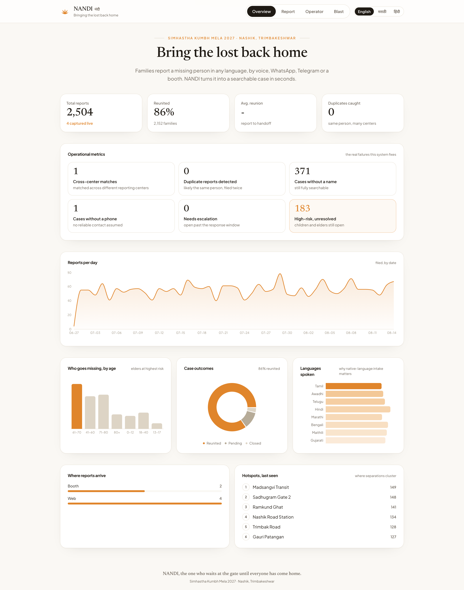
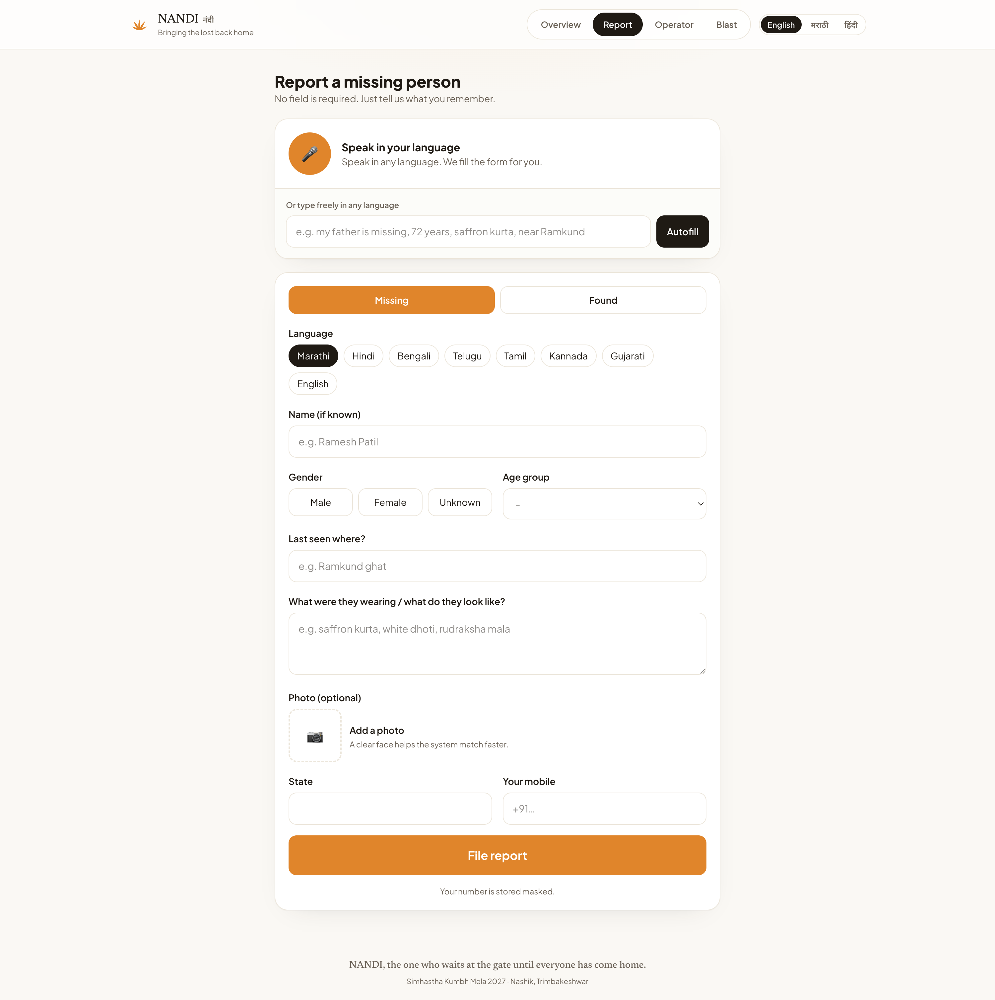
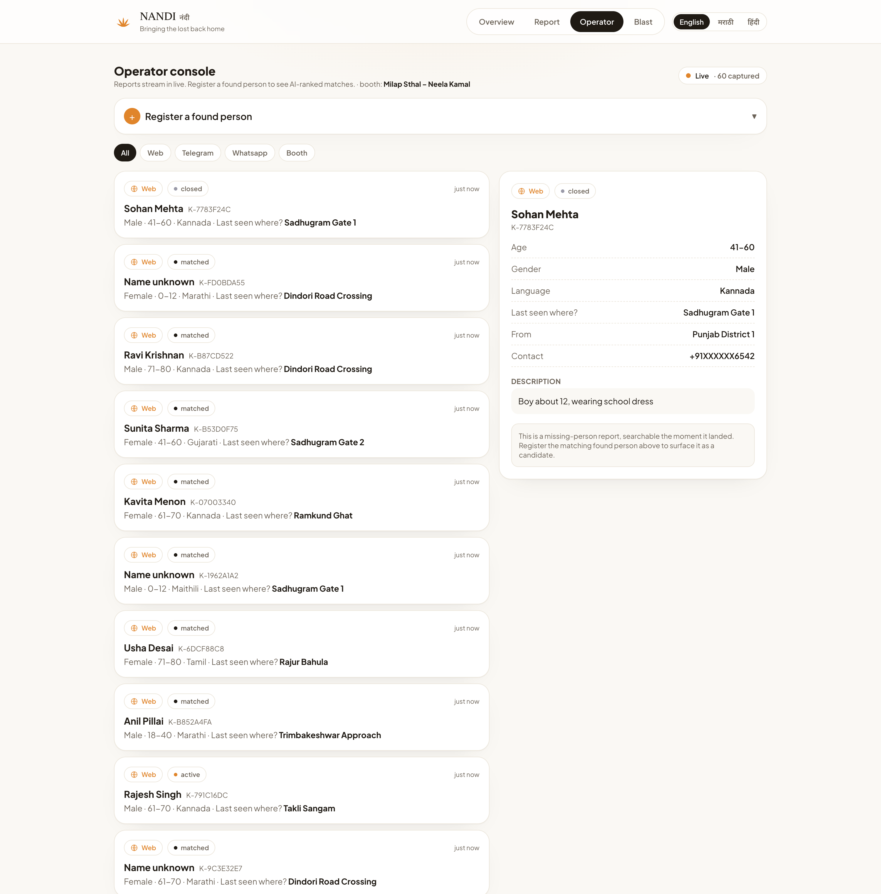
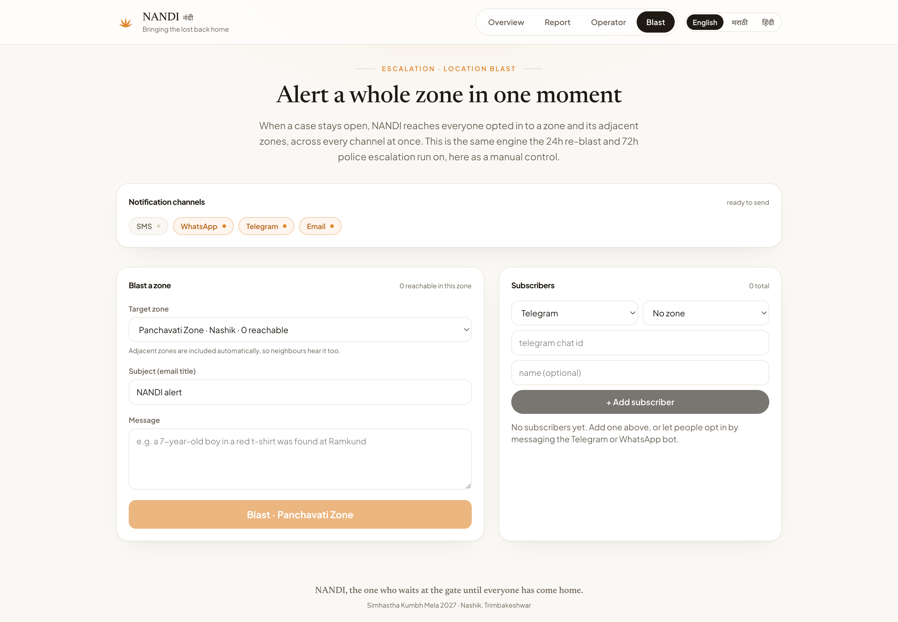
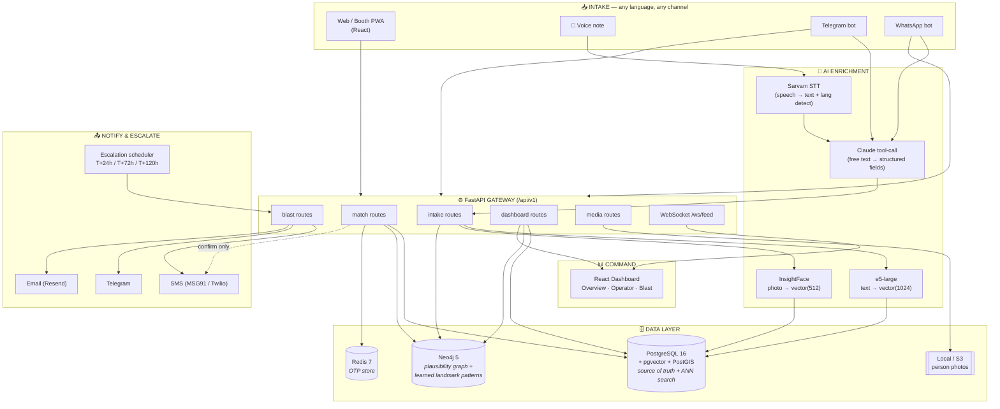
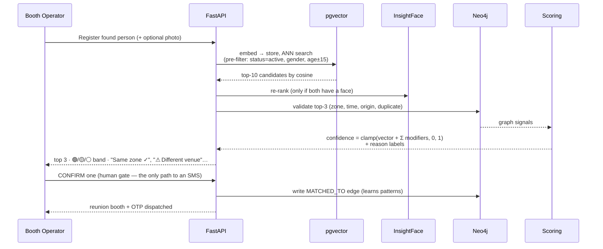

<div align="center">

# 🐂 NANDI

### *The patient one. The one who waits at the gate until everyone has come home.*

**A multilingual, AI-powered missing-persons reunification system for the Simhastha Kumbh Mela 2027**
*Nashik · Trimbakeshwar · 8–10 crore pilgrims*

`नंदी` — named after the sacred bull who guards the threshold at Shiva's gate: patient, watchful, always waiting for the lost to return.

<br/>



</div>

---

## 📖 Table of Contents

1. [The Problem](#-the-problem)
2. [Why We Built This](#-why-we-built-this)
3. [What NANDI Does](#-what-nandi-does)
4. [The System in Action](#-the-system-in-action)
5. [Architecture](#-architecture)
6. [The Matching Pipeline](#-the-matching-pipeline-the-core)
7. [Tech Stack](#-tech-stack)
8. [Key Features](#-key-features)
9. [Repository Layout](#-repository-layout)
10. [Getting Started](#-getting-started)
11. [API Reference](#-api-reference)
12. [Design Decisions](#-design-decisions-why-this-way)
13. [Safety Contracts](#-safety-contracts-non-negotiable)
14. [Roadmap](#-roadmap--out-of-scope)

---

## 🎯 The Problem

The **Simhastha Kumbh Mela 2027** will bring an estimated **8–10 crore pilgrims** to a resident city of 30 lakh. On peak *Shahi Snan* days, a single day's crowd can touch **1 crore**.

At the 2025 Maha Kumbh in Prayagraj, **200–300 people were reported missing every single day.** The tools used to find them — PA announcements, paper registers, ad-hoc WhatsApp groups, word of mouth — **don't scale, don't talk to each other, and don't learn.**

The reality that drives every design decision:

| Constraint | Detail |
|---|---|
| **Language** | Marathi 80%, Hindi 15%, then Telugu / Kannada / Bengali / Tamil / Bhojpuri … |
| **Literacy** | Rural & tribal pilgrims ~68–71% |
| **Tech** | Assume **feature phones**, not smartphones |
| **Network** | Will **collapse** on peak days |
| **Geography** | Two venues, ~30 km apart (Ramkund & Kushavarta Kund) |
| **Highest risk** | Children < 12, elders 65+, solo travellers |

A family that loses their 70-year-old mother — who speaks only Marathi, carries no phone, and was last seen near Ramkund — needs the system to find her **even if she's registered as "found" at a booth 30 km away by an operator who wrote the description in a different language.**

---

## 💡 Why We Built This

Existing "lost & found" desks fail at scale because they rely on **exact, human, single-center matching**. NANDI replaces that with three ideas:

1. **Meaning over keywords.** "भगवा कुर्ता घातलेले वृद्ध गृहस्थ" and "old man in an orange tunic" describe the same person. A multilingual **semantic embedding** makes them match — across languages, across phrasings, across centers.
2. **Plausibility, not just similarity.** Two elderly men in white kurtas look alike on paper. A **graph of venues, zones, time, and origin** scores *which* match is physically plausible and tells the operator *why*.
3. **Humans decide, software assists.** The system **never** auto-notifies. It surfaces the top 3 candidates with a confidence score and plain-language reasons; a booth operator confirms. This is a **safety contract**, not a UX nicety.

And it **degrades gracefully** — if the AI is down, the operator still has a searchable, audited list; if the network is down, the booth still works.

---

## ✨ What NANDI Does

```
Family reports a missing person  ──▶  embedded into a 1024-dim multilingual vector
(voice / web / Telegram / WhatsApp)        + optional photo → 512-dim face vector
                                                       │
A "found" person is registered  ──▶  same pipeline  ──▶  pgvector finds the top-10
at any booth                                              semantically similar reports
                                                       │
                                          Neo4j validates plausibility (zone, time,
                                          origin, language, duplicates)
                                                       │
                                          Composite confidence + reason labels
                                                       │
                                          Operator sees top 3 → CONFIRMS one
                                                       │
                                          Family gets an SMS with booth + OTP
                                          (only on human confirmation)
```

Unresolved cases **escalate automatically**: T+24h → zone-wide blast, T+72h → event-wide blast, T+120h → flagged for police. A **read-only dashboard** gives officials live visibility into volumes, outcomes, languages, hotspots, and the operational failures the system is closing.

---

## 📸 The System in Action

### Voice-first, multilingual intake
*Speak or type in any language — Sarvam transcribes, Claude structures the fields, and an optional photo joins the matching pipeline. No field is required.*



### Operator console — live feed + AI-ranked matches
*Reports stream in over WebSocket. Register a found person and NANDI surfaces the top semantically-similar candidates with confidence bands and plain-language reasons. The operator is the only gate to a notification.*



### Zone blast & escalation
*When a case stays open, reach everyone opted into a zone (and adjacent zones) across SMS / WhatsApp / Telegram / email at once — the same engine the 24h / 72h auto-escalation runs on.*



---

## 🏛 Architecture



**Clean separation of concerns, one job per store:**

| Layer | Tool | Why this and not something else |
|---|---|---|
| Source of truth + vector search | **PostgreSQL + pgvector** | One DB for OLTP *and* embeddings; HNSW ANN is fast enough at this scale; avoids running a separate vector DB |
| Plausibility & relationships | **Neo4j** | Multi-hop traversal (zone → landmark → learned pattern) is native; the same as SQL recursive CTEs but readable and fast |
| OTP + ephemeral cache | **Redis** | Lightweight, TTL-native, battle-tested |
| Photo storage | **Local FS / S3** | Presigned-URL contract; swappable to S3 with one file |

---

## 🔬 The Matching Pipeline (the core)



**Composite confidence** starts from the raw text cosine and is nudged by graph signals:

| Signal | Δ | Label shown to operator |
|---|---|---|
| same zone | +0.08 | Same zone ✓ |
| adjacent zone | +0.04 | Adjacent zone ✓ |
| different venue | −0.12 | ⚠ Different venue |
| same city of origin | +0.06 | Same city of origin ✓ |
| time gap < 2h | +0.07 | Time gap under 2 hours ✓ |
| report > 72h old | −0.08 | ⚠ Report over 3 days old |
| landmark pattern match | +0.07 | Landmark pattern match ✓ |
| language match | +0.04 | Language spoken matches ✓ |
| possible duplicate | −0.05 | ⚠ Possible duplicate report |

**Confidence bands:** ≥ 0.90 🟢 High · 0.75–0.89 🟡 Probable · 0.60–0.74 ⚪ Possible · **< 0.60 never surfaced**. Human confirmation is required at *every* band — there is no auto-confirm, ever.

---

## 🛠 Tech Stack

### Backend
| Component | Choice |
|---|---|
| API framework | **FastAPI** (Python 3.11, async, native WebSockets) |
| ORM / migrations | SQLAlchemy 2.0 (async) + Alembic |
| Text embedding | `intfloat/multilingual-e5-large` — **1024-dim**, multilingual, asymmetric query/passage prefixes |
| Face embedding | **InsightFace** `buffalo_l` (ArcFace) — 512-dim, used for photo re-rank |
| Speech-to-text | **Sarvam** STT (Indian-language auto-detect) |
| Field extraction | **Claude** (`claude-opus-4-8`) tool-calling → structured report fields, any language |
| Notifications | MSG91 / Twilio (SMS · WhatsApp), Resend (email), Telegram Bot API |

### Databases
**PostgreSQL 16** + pgvector (HNSW, `vector_cosine_ops`, partial index on `status='active'`) + PostGIS · **Neo4j 5** · **Redis 7** — all via Docker Compose.

### Frontend
**React 18 + Vite 6 + TypeScript** · **Tailwind CSS v4** · **Recharts** · **react-router** · live updates over native **WebSocket** · in-app **i18n** (English / मराठी / हिंदी).

### Why these models
- **e5-large** handles Marathi ↔ Hindi ↔ English ↔ Telugu *natively* — no translation step, no language validation, one vector space. "saffron kurta + walking stick + rudraksha mala" matches "orange tunic + wooden cane + prayer beads" at **0.90 cosine** with zero shared words. ([Locked at 1024-dim](NANDI-context.md) — changing it means re-indexing everything.)
- **Claude tool-calling** turns a panicked, code-mixed voice note into clean columns and lists *what's still missing to ask next* — degrading to a heuristic if no key is present, so intake never breaks.

---

## 🌟 Key Features

- 🗣 **Voice-first, multilingual intake** — speak in any language; Sarvam transcribes, Claude structures, the form auto-fills.
- 🖼 **Photo + face matching** — attach a photo at intake; a 512-dim face vector joins the matching pipeline and re-ranks candidates.
- 🔍 **True semantic search** — cross-language, cross-phrasing similarity via pgvector ANN (not keyword match).
- 🧩 **Explainable confidence** — every candidate shows *why* (zone, time, origin, language, duplicate), not just a number.
- 🛡 **Human-in-the-loop safety gate** — SMS only on explicit operator confirmation.
- 📣 **Zone blasts + auto-escalation** — reach everyone opted into a zone (and adjacent zones) across SMS / WhatsApp / Telegram / email; 24h / 72h / 120h ladder.
- 📊 **Live read-only dashboard** — volumes, outcomes, languages, hotspots, and *operational* metrics (cross-center matches, duplicates caught, cases without name/phone, high-risk unresolved).
- 🔌 **Multi-channel** — web booth, Telegram bot, WhatsApp bot, all funnelling into one intake pipeline.
- ♻️ **Graceful degradation** — missing API keys → mocks; Neo4j down → signals default false; model absent → deterministic stub. Nothing hard-fails.

---

## 📁 Repository Layout

```
Nandi/
├── server/                      # FastAPI backend
│   ├── api/routes/              # auto-mounted routers (drop a file → it mounts)
│   │   ├── intake.py            #   POST /intake/{missing,found,extract}
│   │   ├── match.py             #   GET /match/{id} · POST /match/{confirm,reject}
│   │   ├── media.py             #   photo upload/serve · voice transcribe
│   │   ├── blast.py             #   zone blasts · subscribers · zones
│   │   ├── dashboard.py         #   stats · feed · patterns · booths
│   │   ├── webhooks.py          #   Telegram / WhatsApp bots
│   │   └── ws.py                #   WebSocket live feed
│   ├── services/                # the brains
│   │   ├── embedding.py         #   text (e5) + face (InsightFace) + cosine
│   │   ├── matcher.py           #   the full ranking pipeline
│   │   ├── scoring.py           #   composite confidence + reason labels
│   │   ├── neo4j_client.py      #   graph sync, validation, landmark patterns
│   │   ├── intake_pipeline.py   #   one funnel every channel shares
│   │   ├── extraction.py        #   Claude → structured fields
│   │   ├── media_store.py       #   local photo storage (S3-shaped)
│   │   └── …                    #   dedup, otp, sms, blast, case_events, sarvam
│   ├── db/models.py             # SQLAlchemy schema (UUID PKs, vector columns)
│   ├── scripts/                 # seed_synthetic · reembed · seed_neo4j · refresh_views
│   ├── graph/                   # Cypher schema + Nashik seed
│   └── docker-compose.yml       # Postgres + Neo4j + Redis
├── frontend/                    # React + Vite dashboard / booth app
│   └── src/pages/               # Overview · Intake · Operator · Blast
├── dataset/                     # 2,500 synthetic missing-persons + zone/CCTV/police CSVs
└── NANDI-context.md             # the canonical condensed project brief
```

---

## 🚀 Getting Started

> 📋 A step-by-step, clone-from-scratch walkthrough (with prerequisite checks and troubleshooting) lives in **[docs/SETUP.md](docs/SETUP.md)**. The quick version is below.

### Prerequisites
- Docker (Postgres + Neo4j + Redis), Python 3.11, Node 18+, and [`uv`](https://github.com/astral-sh/uv).

### 1 · Databases
```bash
cd server
docker compose up -d            # Postgres :5433 · Neo4j :7687 · Redis :6379
```

### 2 · Backend
```bash
cd server
cp .env.example .env            # fill keys; everything degrades to mocks if blank
uv venv ../.venv && source ../.venv/bin/activate
uv pip install -r requirements.txt

alembic upgrade head            # schema + HNSW index + materialized view
python -m scripts.seed_postgres # zones, booths
python -m scripts.seed_neo4j    # graph nodes/edges
python -m scripts.seed_synthetic --truncate   # 2,500 demo reports

# Real semantic search: .env has EMBEDDING_FALLBACK=0 → the e5 + InsightFace
# models load on first use. Re-embed the seed corpus with real vectors ONCE:
python -m scripts.reembed

uvicorn api.main:app --host 127.0.0.1 --port 8137
```
> ℹ️ **Port 8137** — port 8000 is taken by an unrelated service on the dev box; the frontend proxy already points here (`frontend/vite.config.ts`).

### 3 · Frontend
```bash
cd frontend
npm install
npm run dev                     # http://localhost:5173  (proxies /api → :8137)
```

### Degradation knobs
| Env | Effect |
|---|---|
| `EMBEDDING_FALLBACK=1` | deterministic stub embedder — no model download, exact-text matching only |
| no `ANTHROPIC_API_KEY` | extraction falls back to a regex heuristic |
| no `SARVAM_API_KEY` | transcription returns a mock transcript |
| no SMS/WhatsApp/email keys | sends become audited no-ops (logged, never leave the box) |
| Neo4j down | all graph signals default to `false`, matching still runs on text similarity |

---

## 🔌 API Reference

All routes under `/api/v1`, all responses wrapped: `{ "data": …, "error": null, "timestamp": "…Z" }`.

| Method | Route | Purpose |
|---|---|---|
| `POST` | `/intake/missing` | File a missing (or found) report from the web form |
| `POST` | `/intake/found` | Register a found person → returns `found_id` |
| `POST` | `/intake/extract` | Preview structured fields from free text (no save) |
| `POST` | `/media/upload` | Upload a person photo → `photo_url` |
| `GET`  | `/media/file/{name}` | Serve a stored photo |
| `POST` | `/media/transcribe` | Voice note → transcript + detected language |
| `GET`  | `/match/{found_id}` | Top-3 ranked candidates with confidence + reasons |
| `POST` | `/match/confirm` | **Human gate** — confirm one, fire the SMS *(requires `X-Booth-ID`)* |
| `POST` | `/match/reject` | Operator rejected all candidates |
| `POST` | `/internal/validate` | Graph signals for a pair *(server-to-server, `X-Internal-Key`)* |
| `GET`  | `/stats` · `/feed` · `/patterns` · `/booths` | Dashboard data sources |
| `GET`  | `/zones` · `/channels` · `/subscribers` | Blast targeting |
| `POST` | `/blast/zone` · `/blast/found/{id}` | Send a location blast |
| `WS`   | `/ws/feed` | Live report stream to the dashboard |

---

## 🧭 Design Decisions (why this way)

- **UUIDs everywhere, no auto-increment.** Booths generate IDs offline; UUIDs mean offline-created records never collide on sync.
- **Embedding dimension locked at 1024.** It ripples into the schema, the HNSW index, and every embedding call — changing it is a coordinated migration, not a config flip.
- **No language validation, anywhere.** The model is multilingual by design; the only language-specific logic is the SMS template (Marathi first, Hindi fallback).
- **Vector pre-filter is always partial on `status='active'`.** Never a full-table scan; gender/age narrow the ANN search before the cosine comparison.
- **Directory-driven router mounting.** Drop any `api/routes/*.py` exposing a `router` and it auto-mounts — zero merge conflicts in `main.py` for a 4-person team working in parallel.
- **One intake funnel.** Web, Telegram, and WhatsApp all converge on `intake_pipeline` → identical embedding, graph sync, dedup, audit, and live broadcast regardless of channel.

---

## 🛡 Safety Contracts (non-negotiable)

1. **No auto-notification.** An SMS is sent *only* after explicit operator confirmation.
2. **No plaintext phone numbers in logs.** Always masked → `+91XXXXXX7890`.
3. **Offline booths queue, never drop.** No server reach → write locally, never discard.
4. **Marathi first.** Every user-facing string has a Marathi version; English is internal/admin.
5. **Photos are optional everywhere.** A missing photo never blocks a submission.
6. **Every state change is audited** in `case_events` — filed, matched, rejected, blasted, escalated.

---

## 🗺 Roadmap / Out of Scope

**Built & verified:** multilingual semantic search · photo + face ingestion · explainable matching · human-confirm gate · zone blasts · live dashboard · Telegram/WhatsApp intake.

**Next up:** landmark-pattern Sankey panel (data ready via `/patterns`) · MapLibre live map · OTP verify-at-handoff screen · JWT + role-based access.

**Explicitly out of scope (hackathon):** live CCTV facial recognition · Aadhaar/ID verification · police FIR integration · native mobile apps (PWA suffices) · a separate analytics DB.

---

<div align="center">

**नंदी** · *the one who waits at the gate until everyone has come home.*

Built for the Simhastha Kumbh Mela 2027 · Nashik · Trimbakeshwar

</div>
